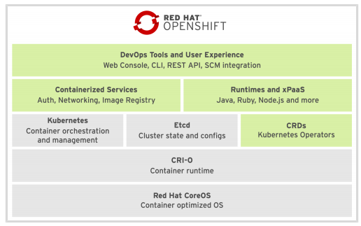
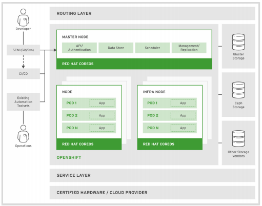

## Background Context

Although I won't be explaining the basics of containers (e.g. "this is your OS with a VM vs. your OS with containers"), I do need to cover certain container-related concepts due to their impact on my podman implementation efforts.


### Linux Kernel Security Features
The Linux kernel uses several technologies to isolate a process inside a server, while still allowing that process access to necessary system resources. These technologies include:
| Technology | Description | Implication |
| :--------- | :---------- | :---------- |
| Namespaces | Used to isolate system resources so that only processes that are members of the namespace can see them. This includes resources like network interfaces, process ID list, mount points, and the system's host name information. | tbd |
| Control groups (cgroups) | Defines groupings of processes and their children, and throttles the amount of system resources each group can use. | tbd|
| Seccomp | Limits how processes can use system calls, via security profiles which whitelist allowed system calls, parameters, and file descriptors. | tbd |
| SELinux (Security-Enhanced Linux) | Access control system for processes, used by the kernel to protect the host and its processes from interference by other processes. | tbd |

From a Linux kernel perspective, a container is simply a process with some restrictions. A container process is not a binary file, however, but rather a file-system bundle that contains all the dependencies needed to execute the process (including files in the file system, necessary packages, resources, and kernel modules).


## Docker, Open Container Initiative (OCI), and CRI-O
Have a look at Avijit Sarkar's [Docker and OCI Runtimes](https://medium.com/@avijitsarkar123/docker-and-oci-runtimes-a9c23a5646d6) and Computing For Geek's [Docker vs CRI-O vs Containerd](https://computingforgeeks.com/docker-vs-cri-o-vs-containerd/) posts and follow the links depending on what you want to learn.

In a nutshell:
* The Docker engine (supposedly pre-v1.11.0) was responsible for all aspects of container management (i.e. image management, lifecycle, creation, resources, etc). 
* The industry decided it wanted open standards around container implementations (namely formats and runtime), and somehow convinced Docker to let the [Open Container Initiative](https://opencontainers.org/about/overview/) guide standards, while Docker reengineered its monolith into smaller componnents that comply with OCI standards.
* Early Kubernetes implementations were bound to a specific container runtime, prompting the creation of the _Container Runtime Interface_ which allows kubelets to use different OCI-compliant runtimes without needing to recompile Kubernetes.
* [CRI-O](https://cri-o.io/) does ... something. Honestly, it just seems like a Docker competitor not controlled by Docker. It also happensto be well-optimized for K8s. 

How is CRI-O different than podman? Dunno, and not gonna waste brainpower on it right now - I'll come back and figure this out once I can stand up multicontainer services on Openshift in my sleep.


### Podman Features
Podman is primarily used to interact with container images and the resulting container processes. Some salient key points:
* It implements the [Openshift Container Initiative](https://www.opencontainers.org) (OCI) image specification.
* It stores images in a local file-system.
* It shadows the Docker CLI command syntax
* It is Kubernetes-compatible
* Can run as rootless (_requiring the use of sudo on all CLI commands_)

See [shortcomings of rootless Podman](https://github.com/containers/podman/blob/master/rootless.md) here.


### Kubernetes Features
| Feature | Description | Implication |
| :------ | :---------- | :---------- |
| Service Discovery & Load Balancing| Kubernetes assigns a single DNS entry to the set of containers that comprise a service. This provide a single consistent URL for other consuming services to use, while allowing the cluster to change the location and IP of those containers as needed. | tbd |
| Horizontal scaling | Pods can scale up and down in response to traffic spikes and troughs. |  tbd |
| Self-Healing | Kubernetes uses liveness and readiness probes to moniter the health of its containers, restarting failing containers as needed. | tbd |
| Automated rollout | Kubernetes can roll out new versions of containers in response to defined system events. | tbd |
| Secrets & Configuration Management | Sensitive data can made available to containers without requiring commitment into source control | tbd |
| Operators | Kubernetes applications that use the Kubernetes API to update the cluster's state in response to application state. | tbd | 

### Kubernetes Terminology
| Term | Definition |
| :------ | :------ |
| NODE | A server that hosts applications in a Kubernetes cluster.|
| MASTER NODE | A node server that manages the `control plane` in a Kubernetes cluster. |
| WORKER NODE | A.k.a `Compute Node`. Executes workloads for the cluster. Worker Node host our application pods.|
| RESOURCE | Any component definition managed by Kubernetes. Contain the configuration and state of a component.|
| CONTROLLER | A Kubernetes process that watches resources and makes changes to move from current state to desired state.|
| LABEL | Key-value pair assigned to a Kubernetes resource. Selectors use these to filter.|
| NAMESPACE | Scope used to segregate Kubernetes resources and processes. This means multiple resources can have the same (so long as they all reside in different namespaces). |

* Note: Training docs mention latest Kubernetes version manages many Controllers as Operators (plug-in components that react to cluster events). Not covered in the training.

### Openshift Features
Overall diagrams<br>
<br>


#### Infra Node vs Worker Node
An Infrastructure Node contains services like monitoring, logging, and external routing that is used across the cluster. (TO DO: how many instances of an Infra Node in a cluster? Worker Nodes run application pods.

#### Kubernetes & Openshift Main Resource Types
| Term | Implemented By | Definition |
| :--- | :------------- | :--------- |
| PODS (po) | Kubernetes | Encapsulated collection of containers that share resources like IP addresses and persistent storage volumes. |
| SERVICES (svc) | Kubernetes | A defined single IP & port that provides access to a pool of pods. Kubernetes keeps track of the location of all the related pods behind the scenes. By default, connects clients via round-robin. | 
| Replication Controllers (rc) | Kubernetes | Defines how pods are horizontally scaled. Critical to providing high-availability. | 
| Persistent Volumes (pv) | Kubernetes | Defined non-ephemeral storage for pods. | 
| Persistent Volumes Claims (pvc) | Kubernetes | Links a persistent volume to a pod, making it available to containers in that pod (usually by mounting the volume into the container's file system). | 
| ConfigMaps (cm) & Secrets | Kubernetes | A set of key-value pairs that can be used by other Resources. CMs and Secrets are used to centralize configuration values used by many resources. Secrets are alwasy encoded (NOT encrypted) and subject to more restrictions on user access. | 
| :--- | :------------- | :--------- |
| Deployment Config (dc) | Openshift | Defines the container set that should be deployed in a pod, as well as the deployment strategy to be used (e.g. graceful vs hard shift) |
| Build config (bc) | Openshift | Defines a process to be executed in an Openshift project. Used by the OC Source-to-Image feature to build containers from source code. Critical to CICD workflows. |
| Routes | Openshift | A DNS host name used by the Openshift router as an ingress point for applications and microservices. |

Note: For a full list of resources, use `oc api-resources` and `kubectl api-resources` for a full list of resources supported by your Kubernetes/OCP installation.


| NODE | A server that hosts applications in a Kubernetes cluster.|

The Openshift Container Platform extends a base Kubernetes implementation with additional features such as:
ADD LATER


### Source Code
The source code I'll be using is publicly available at [https://github.com/RedHatTraining/DO180-apps](https://github.com/RedHatTraining/DO180-apps). I forked the project into my own Github account and then cloned the source code onto my local machine via:
```bash
git clone https://github.com/gwright99/DO180-apps
```


### cGroups
I'm not even going to attempt to explain this with my current level of Linux knowledge. Go read the [WSL2 Linux kernel authoritative definition](https://github.com/microsoft/WSL2-Linux-Kernel/blob/master/Documentation/admin-guide/cgroup-v2.rst) (and good luck!).


### Linux Namespaces
Running podman rootless means you need to start tinkering in custom user namespaces. What the heck are these?

The [namespaces man page](https://www.mankier.com/7/namespaces) describes them as _"A namespace wraps a global system resource in an abstraction that makes it appear to the processes within the namespace that they have their own isolated instance of the global resource. Changes to the global resource are visible to other processes that are members of the namespace, but are invisible to other processes. One use of namespaces is to implement containers."_. 

It further describes the `unshare` command like so _"The unshare(2) system call moves the calling process to a new namespace. If the flags argument of the call specifies one or more of the CLONE_NEW* flags listed below, then new namespaces are created for each flag, and the calling process is made a member of those namespaces. (This system call also implements a number of features unrelated to namespaces.)"_.

The [user namespaces man page](https://www.mankier.com/7/user_namespaces) describes them as _"~User namespaces isolate security-related identifiers and attributes, in particular, user IDs and group IDs, the root directory, keys, and capabilities. A process's user and group IDs can be different inside and outside a user namespace. In particular, a process can have a normal unprivileged user ID outside a user namespace while at the same time having a user ID of 0 inside the namespace; in other words, the process has full privileges for operations inside the user namespace, but is unprivileged for operations outside the namespace."_

This sounds alot like a virtual environment one might use for a Python project (to keep local project packages separate from the main system implementation). By calling [`podman unshare`](https://www.mankier.com/1/podman-unshare), we are essentially telling Linux to take the podman process and run it in an encapsulated environment where the `deeplearning` user is converted to root and has all the powers of root but ONLY WITHIN that name space. Were a process within the pod manage to break out of the container and gain access to the wider system, that process we be treated as a `deeplearning` process rather than a far more dangerous `root` process. 

For a more in-depth description of podman and user namespaces, see this ['Podman and user namespaces: A marriage made in heaven](https://opensource.com/article/18/12/podman-and-user-namespaces) article by Daniel J. Walsh. It provides a better overview than what I've provided above and further details on:
* Why podman can use different user namespaces on the same image (_hint: automatic chowning_).
* How podman removes the user namespace influence when using `podman build` or `podman commit` to push an image to a container registry (where it needs to be root).

If you are trying to [run a rootless podman with an NFS share](https://www.redhat.com/sysadmin/rootless-podman-nfs), Walsh has a different article. I'm not running NFS and I already have enough problems to deal with, so I'm ignoring it for now but mention it just in case it's needed for later reference (_hint: It seems to be related to UID/GID clashes which is harder to do since you've got to account for the decisions of a local kernel AND remote kernel_).

Now that you've got a bit of background, let's compare a `top` command executed in my ubuntu shell as user `deeplearning`, versus one I've executed after I've run the `podman unshare` command.

The results of `top` when run as deeplearning.

```bash
# whomai
deeplearning

# id
uid=1000(deeplearning) gid=1000(deeplearning) groups=1000(deeplearning),4(adm),20(dialout),24(cdrom),25(floppy),27(sudo),29(audio),30(dip),44(video),46(plugdev),117(netdev),1001(docker)

# top
  PID USER      PR  NI    VIRT    RES    SHR S  %CPU  %MEM     TIME+ COMMAND
16395 deeplea+  20   0   10888   3716   3140 R   0.3   0.0   0:00.05 top
    1 root      20   0     900    576    520 S   0.0   0.0   0:00.04 init
   77 root      20   0     892     80     16 S   0.0   0.0   0:00.00 init
   78 root      20   0     892     80     16 S   0.0   0.0   0:00.00 init
   79 deeplea+  20   0  742296  27316  17556 S   0.0   0.1   0:07.96 docker
   80 root      20   0       0      0      0 Z   0.0   0.0   0:00.01 init
   82 root      20   0       0      0      0 Z   0.0   0.0   0:00.00 init
  176 root      20   0     892     80     16 S   0.0   0.0   0:00.00 init
  177 root      20   0     892     80     16 S   0.0   0.0   0:00.00 init
  178 deeplea+  20   0  742296  29592  18016 S   0.0   0.2   0:07.63 docker
  179 root      20   0       0      0      0 Z   0.0   0.0   0:00.00 init
  195 root      20   0     892     80     16 S   0.0   0.0   0:00.00 init
  196 root      20   0  639152  26624  10420 S   0.0   0.1   0:05.08 docker-desktop-
  208 root      20   0     892     80     16 S   0.0   0.0   0:04.60 init
  311 deeplea+  20   0   41204   1300   1052 S   0.0   0.0   0:00.00 podman pause
  374 deeplea+  20   0    7096   2464   2104 S   0.0   0.0   0:00.00 dbus-daemon
 7101 root      20   0     892     80     16 S   0.0   0.0   0:00.00 init
 7102 root      20   0     892     80     16 S   0.0   0.0   0:06.12 init
 7103 deeplea+  20   0   11804   7000   3544 S   0.0   0.0   0:20.04 bash
 7447 root      20   0     892     80     16 S   0.0   0.0   0:00.00 init
 7448 root      20   0     892     80     16 S   0.0   0.0   0:00.46 init
 7449 deeplea+  20   0   10292   5412   3516 S   0.0   0.0   0:00.64 bash
 7514 deeplea+  20   0   41204   1168    920 S   0.0   0.0   0:00.00 podman pause
14875 root      20   0     900     88     16 S   0.0   0.0   0:00.00 init
14876 root      20   0     900     88     16 S   0.0   0.0   0:01.52 init
14877 deeplea+  20   0   11088   6116   3412 S   0.0   0.0   0:00.96 bash
16026 deeplea+  20   0    4672   1916   1308 S   0.0   0.0   0:00.03 fuse-overlayfs
16029 deeplea+  20   0    2584   1680   1556 S   0.0   0.0   0:00.75 slirp4netns
16032 deeplea+  20   0   80448   1956   1688 S   0.0   0.0   0:00.00 conmon
16043 deeplea+  20   0    4112   3268   2852 S   0.0   0.0   0:00.04 bash
```

The results of `top` when run as root within the user namespace. 
Note that the processes that used to belong to `deeplearning` now show as belonging to `root`, and the processes that belonged to `root` now appear to belong to `nobody`.

```bash
# podman unshare
   (prompt switches to root@DESKTOP-MC34QIL)
   
# whomai
root

# id
uid=0(root) gid=0(root) groups=0(root),65534(nogroup)

# top
  PID USER      PR  NI    VIRT    RES    SHR S  %CPU  %MEM     TIME+ COMMAND
    1 nobody    20   0     900    576    520 S   0.0   0.0   0:00.04 init
   77 nobody    20   0     892     80     16 S   0.0   0.0   0:00.00 init
   78 nobody    20   0     892     80     16 S   0.0   0.0   0:00.00 init
   79 root      20   0  742296  27316  17556 S   0.0   0.1   0:07.98 docker
   80 nobody    20   0       0      0      0 Z   0.0   0.0   0:00.01 init
   82 nobody    20   0       0      0      0 Z   0.0   0.0   0:00.00 init
  176 nobody    20   0     892     80     16 S   0.0   0.0   0:00.00 init
  177 nobody    20   0     892     80     16 S   0.0   0.0   0:00.00 init
  178 root      20   0  742296  29592  18016 S   0.0   0.2   0:07.64 docker
  179 nobody    20   0       0      0      0 Z   0.0   0.0   0:00.00 init
  195 nobody    20   0     892     80     16 S   0.0   0.0   0:00.00 init
  196 nobody    20   0  639152  26624  10420 S   0.0   0.1   0:05.12 docker-desktop-
  208 nobody    20   0     892     80     16 S   0.0   0.0   0:04.60 init
  311 root      20   0   41204   1300   1052 S   0.0   0.0   0:00.00 podman pause
  374 root      20   0    7096   2464   2104 S   0.0   0.0   0:00.00 dbus-daemon
 7101 nobody    20   0     892     80     16 S   0.0   0.0   0:00.00 init
 7102 nobody    20   0     892     80     16 S   0.0   0.0   0:06.12 init
 7103 root      20   0   11804   7000   3544 S   0.0   0.0   0:20.04 bash
 7447 nobody    20   0     892     80     16 S   0.0   0.0   0:00.00 init
 7448 nobody    20   0     892     80     16 S   0.0   0.0   0:00.46 init
 7449 root      20   0   10292   5412   3516 S   0.0   0.0   0:00.64 bash
 7514 root      20   0   41204   1168    920 S   0.0   0.0   0:00.00 podman pause
14875 nobody    20   0     900     88     16 S   0.0   0.0   0:00.00 init
14876 nobody    20   0     900     88     16 S   0.0   0.0   0:01.56 init
14877 root      20   0   11088   6116   3412 S   0.0   0.0   0:00.98 bash
16026 root      20   0    4672   1916   1308 S   0.0   0.0   0:00.03 fuse-overlayfs
16029 root      20   0    2584   1680   1556 S   0.0   0.0   0:00.77 slirp4netns
16032 root      20   0   80448   1956   1688 S   0.0   0.0   0:00.00 conmon
16043 root      20   0    4112   3268   2852 S   0.0   0.0   0:00.04 bash
16405 root      20   0 1335804  42764  26240 S   0.0   0.2   0:00.31 podman
16415 root      20   0   10008   5008   3308 S   0.0   0.0   0:00.01 bash
16422 root      20   0   10888   3684   3112 R   0.0   0.0   0:00.00 top
```

### Linux Namespaces Part 2
I found another Dan Walsh article that requires mentioning: [Running rootless Podman as a non-root user](https://www.redhat.com/sysadmin/rootless-podman-makes-sense). 

I had to read this a few times to make sure I really grokked it. A reader had asked for help figuring out how to run in container where:
* Their podman instance was running rootless.
* The process running inside the container was `postgres` instead of `root`.
* There was UID mismatch when trying to mount a folder in the user's /home/ directory into the container, where `podman unshare` was changing the ownership of the folder to `root` (UID 0) within the user namespace, but the container process was `postgres` (UID 26). This meant that the container process could not write data to the mounted directory. 
* Walsh ultimately solves the proble with `podman unshare chown 26:26 ...` 

I'm not 100% on why this works. I'm not even sure I need this (I plan to let my the processes inside my containers run as root). I'm making a note about this solution though just in case I run into problem later on that could be attributable to this situation.

Update: A newer (June 18, 2020) article by Walsh, [Should you use the --user flag in rootless containers?](https://www.redhat.com/sysadmin/user-flag-rootless-containers) identifies the `--userns=keep-id` flag that tells Podman to create a user namespace where the current rootless use's UID:GID map to the same values in the container (_which results in the loss of root capabilities, but which may be regained via us of 'su' and/or 'sudo'_).
