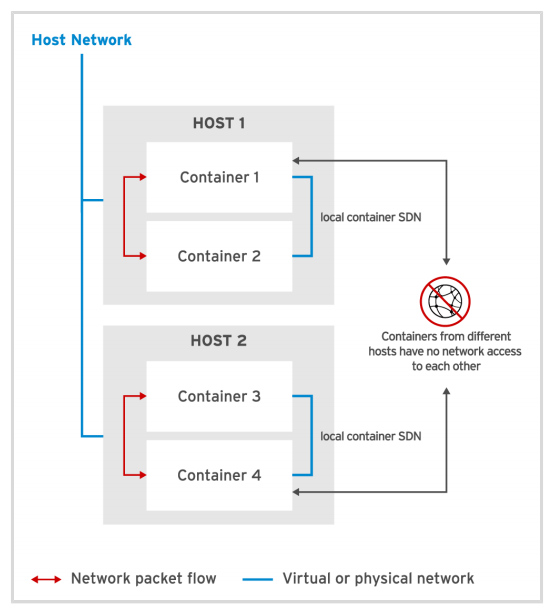

## Podman Networking Basics

The Container Networking Interface (CNI) [open source project](https://www.cncf.io/blog/2017/05/23/cncf-hosts-container-networking-interface-cni/) is used to standardize the network interface for containers in cloud environments. A configuration file exists on the host at `/etc/cni/net.d/87-podman-bridge.conflist`.

Podman uses CNI to link containers to a host via a software-defined network (SDN). Here's how it works (_note: I'm not sure if this is for root, rootless, or both_):
* Each container on the host is assigned a private IP address
* Each container is attached to a virtual bridge (I'm a little shakey on this but Red Hat's [Introduction to Linux interfaces for virtual networking](https://developers.redhat.com/blog/2018/10/22/introduction-to-linux-interfaces-for-virtual-networking/#bridge) post has lots of info), which allows every container on the host to communicate with every other container on that host.
* Containers created on a different host belong to their own software-defined network.
* A container that exists on SDN A cannot directly communicate with a container on SDN B.
* By default, container networks are hidden from the host network.




Given that container IPs can change frequently and are mostly opaque to the host, how does the host ensure that it can access a specific container? You have two possibilities:
1. Container Port Forwarding
1. Pod encapsulation (TO DO: GET DETAILS ON THIS)


### Container Port Forwarding
Container port forwarding is pretty straightforward - pick a (high number) port on the host and link that to a port that the container exposes. Any call to the host on that port will be pass through to the container for action.
```bash
# podman run -d --name nginx-webserver -p 8080:80 docker.io/library/nginx
```
Any request sent to the host on port 8080 will pass through to the container on port 80, where the containerized nginx webserver will handle the request and return a response which will pass back through the host and onto the requestor. 

The training docs say you can tighten this access further by specifying that all trust must come through `localhost`, like so:
```bash
# podman run -d --name nginx-webserver -p 127.0.0.1:8080:80 docker.io/library/nginx
```
I must be missing something here, because I assumed that localhost was implied in our first command? Given that the container lives on the host and must use the host's resources (e.g. network connections) to reach the outside world, doesn't that mean that ALL traffic must flow through the host? Perhaps what they meant is you can use the second command to stop the nginx container from accepting connections from other containers in it SDN? Dunno, will need to research more.

You can also implement port forwarding without specifying the host port the forward (allowing Podman to choose the first available port):
```bash
# podman run -d --name nginx-webserver -p 127.0.0.1::80 docker.io/library/nginx
1f8dfe821816cd05659c8685bc1356b56a7b7108230f711047b9d6784063b03a

# podman port nginx-webserver
80/tcp -> 127.0.0.1:41849
```
This technique strikes me as a bit dumb because it means I need to run a second follow-up command to see what Podman randomly chose (and then remember it). I suppose it might make sense if you have lots of ports in use that it becomes hard to find one that is available (is this actually possible?) or maybe you are doing this for security reasons to make it harder for someone to guess what ports are open? Once again, it's not super well explained why I would do this, so I've noted it because intend to always specify the host port as an assumptive best practice until proven otherwise.
 

