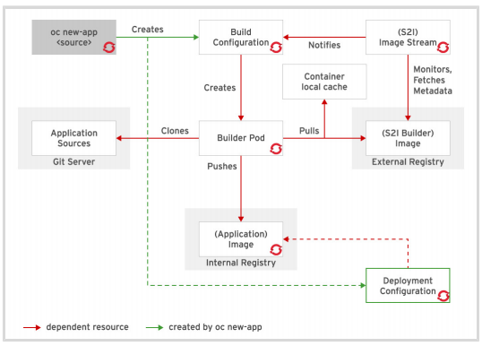
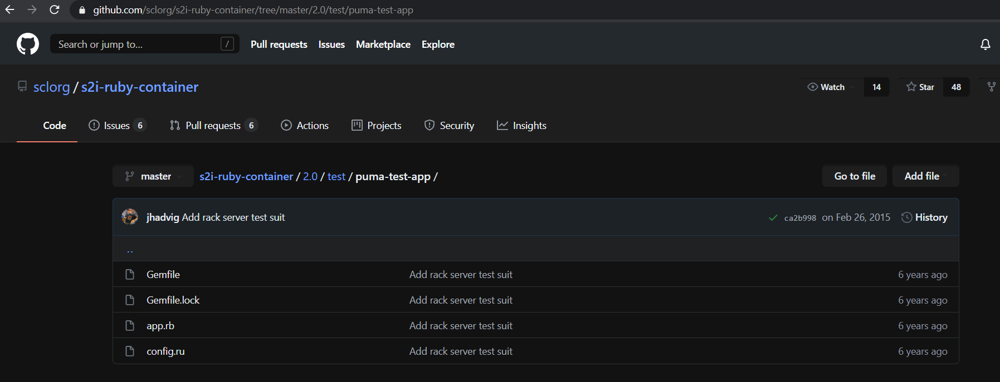

## Source-to-Image (S2I)
Source-to-Image is an OpenShift tool used to create containers based on application source code. The tool collects the source code from a Git repository, injects the source code into a base container that is configured for its programming language, and produces a new container image that runs the assembled application.

<br>

S2I is the suggested primary strategy for building applicationns in OpenShift because:
* It removes the need for developers to understand Dockerfiles and many Linux system commands.
* Allows for rebuilding applications consistently if a base image needs a patch due to a security issue.
* Assembly process can perform a large number of complex operations without requiring a layer for each step.
* Encourages reuse of base images and scripts across multiple types of applications.

### What's an Image Stream?
The [OCP documentation] defines an Image Stream as:

_'an abstraction for referencing Docker images within the OpenShift Container Platform. The image stream and its tags allow you to see what images are available and ensure you are using the specific image you need even if the image in the repository changes. <br>Image streams do not contain actual image data, but present a single virtual view of related images, similar to an image repository.<br>You can configure Builds and Deployments to watch an image stream for notifications when new images are added and react by performing a Build or Deployment, respectively.<br>For example, if a Deployment is using a certain image and a new version of that image is created, a Deployment could be automatically performed to pick up the new version of that image.<br>However, if the image stream tag used by the Deployment or Build is not updated, then even if the Docker image in the Docker registry is updated, the Build or Deployment will continue using the previous (presumably known good) image.'_

Essentially, I'm thinking about it like this: You've build an application on top of an OS image that is discovered to have a zero-day vulnerability. There's nothing wrong with your own code, it's the OS that needs patching. If you build the application using an Image Stream as the reference to your base OS, OCP will automatically update all your pods when the referenced (patched) image is deployed to your image repository. If you pinned to a specific container image instead of using an Image Stream, you would need to go through a new manual repackaging & repromotion exercise to get a fixed image back into Production. 

My example focuses on a security patch, but this holds true equally well for the builder images that are used to create images via the OpenShift Source-to-Image technique. To determine the available image streams in your cluster use `oc get is -n openshift`
```bash
# oc get is -n openshift
NAME            IMAGE REPOSITORY                        TAGS
cli             ...svc:5000/openshift/cli               latest
dotnet          ...svc:5000/openshift/dotnet            2.0,2.1,latest
dotnet-runtime  ...svc:5000/openshift/dotnet-runtime    2.0,2.1,latest
httpd           ...svc:5000/openshift/httpd             2.4,latest
jenkins         ...svc:5000/openshift/jenkins           1,2
...
```

S2i can build images based on:
* Remote code repositories
* Local code repositories (must be working directory)
* Dockerfile

To create an application via S2i, you must make some minor modifications to the `oc new-app` command:
```bash
# oc new-app --as-deployment-config php~http://<REMOTE.GIT.URL>/<REMOTE.REPOSITORY --name=myapp
# oc new-app --as-deployment-config -i php http://<REMOTE.GIT.URL>/<REMOTE.REPOSITORY --name=myapp
# oc new-app --as-deployment-config .  --name=myapp
```
The language-specific builder image can be defined in two ways:
* To the left of the tilde `~` that connects the language to the source code repository (e.g. `php~http://<REMOTE.GIT.URL>/....`
* Specified with the `-i` flag (e.g. `... -i php http://<REMOTE.GIT.URL>/....

If you do not specify the language, Openshift will try to identify the correct image stream for building the application (based on the presence of specific language-specific files in the folder). Given how easy it is to identify the correct image stream, not explicitly identifying the image stream seems very lazy.

You can further specify the location of your source code by also identifying the `context-dir` or `branch`. Examples:
```bash
Specific folder in the repository:
# oc new-app --as-deployment-config https://github.com/openshift/sti-ruby.git --context-dir=2.0/test/puma-test-app

Specific branch in the repository:
# oc new-app --as-deployment-config https://github.com/openshift/ruby-hello-world.git#beta4
```



This is great, but how does it actually work? Let's start by generating a new Image Stream-based project and output it to a json file so we can examine it (Note: My OCP lab doesn't allow me to cut and paste content from its console to this blog, so I wont be able to paste everything).

Outputting the results of the new-app command will create a List object that contains four other objects :
* ImageStream
* BuildConfig
* DeploymentConfig
* Service

```bash
# oc -o json new-app --as-deployment-config php~http://services.lab.example.com/app --name=myapp > s2i.json
{
  "kind": "List",
  "apiVersion": "v1",
  "metadata": {},
  "items": [
    {
      "kind": "ImageStream",
      "apiVersion": "image.openshift.io/v1",
      "metadata": {
        "name": "myapp",
        "creationTimestamp": null,
        "labels": {
          "app": "myapp",
          "app.kubernetes.io/component": "myapp",
          "app.kubernetes.io/instance": "myapp"
        },
        "annotations": {
          "openshift.io/generated-by": "OperShiftNewApp"
        }
      },
      "spec": {
        "lookupPolicy": {
          "local": false
        }
      },
      "status": {
        "dockerImageRepository": ""
      }
    },
    {
      "kind": "BuildConfig",
      "apiVersion": "build.openshift.io/v1",
      "metadata": {
        "name": "myapp",
        "creationTimestamp": null,
        "labels": {
          "app": "myapp",
          "app.kubernetes.io/component": "myapp",
          "app.kubernetes.io/instance": "myapp"
        },
        "annotations": {
          "openshift.io/generated-by": "OpenShiftNewApp"
        }
      },
      "spec": {
        "triggers": [
          {
            "type": "GitHub",
            "github": {
              "secret": <SECRET_HERE>
            }
          },
          {
            "type": "Generic",
            "generic": {
              "secret": <SECRET_HERE>
            }
          },
          {
            "type": "ConfigChange",
          },
          {
            "type": "ImageChange",
            "imageChange": {}
          }
        ],
        "source": {
          "type": "Git",
          "git": {
            "uri": "http://services.lab.example.com/app"
          }
        },
        "strategy": {
          "type": "Source",
          "sourceStrategy": {
            "from": {
              "kind": "ImageStreamTag",
              "namespace": "openshift",
              "name": "php:7.3"
            }
          }
        },
        "output": {
          "to": {
            "kind": "ImageStreamTag",
            "name": "myapp:latest"
          }
        },
        "resources": {},
        "postCommit": {},
        "nodeSeletor": null
      },
      "status": {
        "lastVersion": 0
      }
    },
    {
      "kind": "DeploymentConfig"
      "spec": {
        "strategy": {
          "resources": {}
        },
        "triggers": [
          {
            "type": "ConfigChange"
          },
          {
            "type": "ImageChange",
            "imageChangeParams": {
              "automatic": true,
              "containerNews": [
                "myapp"
              ],
              "from": {
                "kind": "ImageStreamTag",
                "name": "myapp:latest"
              }
            }
          }
        ],
        ...
        "template": {
          "metadata: { ...},
          "spec": {
            "containers": [
              {
                "name": "myapp",
                "image": "myapp:latest",
                "ports": [
                  {
                    "containerPort": 8080,
                    "protocol": "TCP:
                  },
                  {
                    "containerPort": 8443,
                    "protocol": "TCP"
                  }
                ],
                ...
    },
    {
      "kind": "Service"
      ...
    }
  ]
}
```
There's alot going on here, but here are the most important parts:
* We defined the app as being based on an ImageStream (TO DO: figure out why my building an oc new-app from an image without using tilde also showed up as ImageStream).
* The BuildConfig identifies:
    * Where the source code repository is located
    * That the S2I method should be used to build the image
    * Should use the `php:7.3` image as its builder image
    * Should save the resulting builder image output as `myapp:latest`
* The DeploymentConfig identifies:
    * It should deploy a new container whenever the Replication Controller template changes
    * It should deploy a new container whenever a new version of the `myapp:latest` container is available in the repository.
    * Whenever a new container must be deployed, it should use the `myapp:latest` container
    * Specifies container ports
    

This doesn't work in the RH OCP. I must have messed something up:
```bash
# oc get builds
# oc logs build/<BUILD CONTAINER>
# oc start-build build-config-name
# oc get buildconfig
# oc start-build myapp
```

## Building an App with S2i
The training has an example to build a php application from source. I'm going to walk through it and try to unpack what's going on.

I'm actually really confused by what this tutorial is trying to get us to do. On page 183 of the training materials, there is a throwaway line says this is the _'PHP version 5.6 Source-to-Image container'_ and they have us look at the material in `~/DO180/lab/openshift-s2i/`. Originally I thought I needed to do the same if I ever wanted to deploy a new a new appplication, but now I wonder if this is just an EXAMPLE of the builder image that I'll use when actually trying to use S2i? But the actual file we mess with is a single, three-line index.html file in the DO180-apps repository (s2i branch), and we point out image stream command to a different version of php (7.3). Did they give me a full application just for demonstration purposes? What is part of the builder versus part of an application I need to provide myself? 

Rather than continue to get frustrated, I'll just dump the files in question and circle around at some point to see if I can figure wtf is really going on here. I've got a super confused face right now though.

```bash
# tree s2i-php-container
s2i-php-container/
├── 5.6
│   ├── cccp.yml
│   ├── contrib
│   │   └── etc
│   │   ├── conf.d
│   │   │   ├── 00-documentroot.conf.template
│   │   │   └── 50-mpm-tuning.conf.template
│   │   ├── httpdconf.sed
│   │   ├── php.d
│   │   │   └── 10-opcache.ini.template
│   │   ├── php.ini.template
│   │   └── scl_enable
DO180-OCP4.5-en-2-20200911 183
Chapter 6 | Deploying Containerized Applications on OpenShift
│   ├── Dockerfile
│   ├── Dockerfile.rhel7
│   ├── README.md
│   ├── s2i
│   │   └── bin
│   │   ├── assemble
│   │   ├── run
│   │   └── usage
│   └── test
│   ├── run
│   └── test-app
│   ├── composer.json
│   └── index.php
├── hack
│   ├── build.sh
│   └── common.mk
├── LICENSE
├── Makefile
└── README.md
```

There are two bash scripts and a custom Dockerfile that makes changes to an image in order to play nicely with Openshift's restrictions that prevents a container from running as root:

_/home/student/DO180/labs/openshift-s2i/s2i-php-container/5.6/s2i/bin/assemble.sh_:
```bash
#!/bin/bash

set -e

shopt -s dotglob
echo "---> Installing application source..."
mv /tmp/src/* ./

if [ -f composer.json ]; then
  echo "Found 'composer.json', installing dependencies using composer.phar... "

  # Install Composer
  curl https://getcomposer.org/installer | php

  # Change the repo mirror if provided
  if [ -n "$COMPOSER_MIRROR" ]; then
    ./composer.phar config -g repositories.packagist composer $COMPOSER_MIRROR
  fi

  # Install App dependencies using Composer
  ./composer.phar install --no-interaction --no-ansi --optimize-autoloader

  if [ ! -f composer.lock ]; then
    echo -e "\nConsider adding a 'composer.lock' file into your source repository.\n"
  fi
fi

# Fix source directory permissions
fix-permissions ./
```

_/home/student/DO180/labs/openshift-s2i/s2i-php-container/5.6/s2i/bin/run.sh_:
```bash
#!/bin/bash

export_vars=$(cgroup-limits); export $export_vars
export DOCUMENTROOT=${DOCUMENTROOT:-/}

# Default php.ini configuration values, all taken
# from php defaults.
export ERROR_REPORTING=${ERROR_REPORTING:-E_ALL & ~E_NOTICE}
export DISPLAY_ERRORS=${DISPLAY_ERRORS:-ON}
export DISPLAY_STARTUP_ERRORS=${DISPLAY_STARTUP_ERRORS:-OFF}
export TRACK_ERRORS=${TRACK_ERRORS:-OFF}
export HTML_ERRORS=${HTML_ERRORS:-ON}
export INCLUDE_PATH=${INCLUDE_PATH:-.:/opt/app-root/src:/opt/rh/rh-php56/root/usr/share/pear}
export SESSION_PATH=${SESSION_PATH:-/tmp/sessions}
export SHORT_OPEN_TAG=${SHORT_OPEN_TAG:-OFF}
# TODO should be dynamically calculated based on container memory limit/16
export OPCACHE_MEMORY_CONSUMPTION=${OPCACHE_MEMORY_CONSUMPTION:-128}

export OPCACHE_REVALIDATE_FREQ=${OPCACHE_REVALIDATE_FREQ:-2}

export PHPRC=${PHPRC:-/etc/opt/rh/rh-php56/php.ini}
export PHP_INI_SCAN_DIR=${PHP_INI_SCAN_DIR:-/etc/opt/rh/rh-php56/php.d}

envsubst < /opt/app-root/etc/php.ini.template > /etc/opt/rh/rh-php56/php.ini
envsubst < /opt/app-root/etc/php.d/10-opcache.ini.template > /etc/opt/rh/rh-php56/php.d/10-opcache.ini

export HTTPD_START_SERVERS=${HTTPD_START_SERVERS:-8}
export HTTPD_MAX_SPARE_SERVERS=$((HTTPD_START_SERVERS+10))

if [ -n "${NO_MEMORY_LIMIT:-}" -o -z "${MEMORY_LIMIT_IN_BYTES:-}" ]; then
  #
  export HTTPD_MAX_REQUEST_WORKERS=${HTTPD_MAX_REQUEST_WORKERS:-256}
else
  # A simple calculation for MaxRequestWorkers would be: Total Memory / Size Per Apache process.
  # The total memory is determined from the Cgroups and the average size for the
  # Apache process is estimated to 15MB.
  max_clients_computed=$((MEMORY_LIMIT_IN_BYTES/1024/1024/15))
  # The MaxClients should never be lower than StartServers, which is set to 5.
  # In case the container has memory limit set to <64M we pin the MaxClients to 4.
  [[ $max_clients_computed -le 4 ]] && max_clients_computed=4
  export HTTPD_MAX_REQUEST_WORKERS=${HTTPD_MAX_REQUEST_WORKERS:-$max_clients_computed}
  echo "-> Cgroups memory limit is set, using HTTPD_MAX_REQUEST_WORKERS=${HTTPD_MAX_REQUEST_WORKERS}"
fi

envsubst < /opt/app-root/etc/conf.d/50-mpm-tuning.conf.template > /opt/app-root/etc/conf.d/50-mpm-tuning.conf
envsubst < /opt/app-root/etc/conf.d/00-documentroot.conf.template > /opt/app-root/etc/conf.d/00-documentroot.conf

exec httpd -D FOREGROUND
```

_/home/student/DO180/labs/openshift-s2i/s2i-php-container/5.6/Dockerfile.rhel7_:
```docker
FROM rhscl/s2i-base-rhel7

# This image provides an Apache+PHP environment for running PHP
# applications.

EXPOSE 8080

ENV PHP_VERSION=5.6 \
    PATH=$PATH:/opt/rh/rh-php56/root/usr/bin

LABEL io.k8s.description="Platform for building and running PHP 5.6 applications" \
      io.k8s.display-name="Apache 2.4 with PHP 5.6" \
      io.openshift.expose-services="8080:http" \
      io.openshift.tags="builder,php,php56,rh-php56"

# Labels consumed by Red Hat build service
LABEL name="rhscl/php-56-rhel7" \
      com.redhat.component="rh-php56-docker" \
      version="5.6" \
      release="3" \
      architecture="x86_64"

# Install Apache httpd and PHP
# To use subscription inside container yum command has to be run first (before yum-config-manager)
# https://access.redhat.com/solutions/1443553
RUN yum repolist > /dev/null && \
    yum-config-manager --enable rhel-server-rhscl-7-rpms && \
    yum-config-manager --enable rhel-7-server-optional-rpms && \
    INSTALL_PKGS="rh-php56 rh-php56-php rh-php56-php-mysqlnd rh-php56-php-pgsql rh-php56-php-bcmath \
                  rh-php56-php-gd rh-php56-php-intl rh-php56-php-ldap rh-php56-php-mbstring rh-php56-php-pdo \
                  rh-php56-php-pecl-memcache rh-php56-php-process rh-php56-php-soap rh-php56-php-opcache rh-php56-php-xml \
                  rh-php56-php-pecl-xdebug rh-php56-php-gmp" && \
    yum install -y --setopt=tsflags=nodocs $INSTALL_PKGS && \
    rpm -V $INSTALL_PKGS && \
    yum clean all -y

# Copy the S2I scripts from the specific language image to $STI_SCRIPTS_PATH
COPY ./s2i/bin/ $STI_SCRIPTS_PATH

# Each language image can have 'contrib' a directory with extra files needed to
# run and build the applications.
COPY ./contrib/ /opt/app-root

# In order to drop the root user, we have to make some directories world
# writeable as OpenShift default security model is to run the container under
# random UID.
RUN sed -i -f /opt/app-root/etc/httpdconf.sed /opt/rh/httpd24/root/etc/httpd/conf/httpd.conf && \
    sed -i '/php_value session.save_path/d' /opt/rh/httpd24/root/etc/httpd/conf.d/rh-php56-php.conf && \
    head -n151 /opt/rh/httpd24/root/etc/httpd/conf/httpd.conf | tail -n1 | grep "AllowOverride All" || exit && \
    echo "IncludeOptional /opt/app-root/etc/conf.d/*.conf" >> /opt/rh/httpd24/root/etc/httpd/conf/httpd.conf && \
    mkdir /tmp/sessions && \
    chown -R 1001:0 /opt/app-root /tmp/sessions && \
    chmod -R a+rwx /tmp/sessions && \
    chmod -R ug+rwx /opt/app-root && \
    chmod -R a+rwx /etc/opt/rh/rh-php56 && \
    chmod -R a+rwx /opt/rh/httpd24/root/var/run/httpd

USER 1001

# Set the default CMD to print the usage of the language image
CMD $STI_SCRIPTS_PATH/usage
```

Confusing bs section ove, lets see if we can create a simple s2i helloworld. First, we need to get our environment set up. Since this exercise involves triggering a new build/deployment based on changes in a remote code repository, we need to:
1. Clone the repository to our local machine
1. Create a new branch on the local machine
1. Push the branch to the remote repository (for the ImageSteam to pick up)

Set up the source code in the remote repository first:
```bash
Get the source code ready
# pwd
/home/student/

# git clone https://www.github.com/gwright99/DO180-apps/
Cloning into 'DO180-apps'...
remote: Enumerating objects: 86, done.
remote: Total 86 (delta 0), reused 0 (delta), pack-reused 86
Upacking objects: 100% (86/86), done.

# cd ~/DO180-apps
# git checkout master
# git checkout -b s2i
# git push -u origin s2i
...
* [new branch]      s2i -> s2i
Branch s2i set up to track remote branch s2i from origin

# cat /home/student/DO180-apps/php-helloworld/index.php
<?php
print "Hello, World!" php version is " . PHP_VERSION . "\n";
?>
```

With that done, build and deploy the container:
```bash
# oc login -u <USERNAME> -p <PASSWORD> <OCP_API_ENDPOINT>
# oc new-project s2i-test
# oc new-app --as-deployment-config --name=php-helloworld php:7.3~https://github.com/gwright99/DO180-apps --context-dir php-helloworld
<POD BUILT AND DEPLOYED>

# oc get pods
NAME                        READY         STATUS      RESTARTS  AGE
php-helloworld-1-build      0/1           Completed   0         68s
php-helloworld-1-deploy     0/1           Completed   0         32s
php-helloworld-1-429cn      1/1           Running     0         29s

# oc logs --all-containers -f php-helloworld-1-build
```
I can't export the text from the Red Hat training workstation I'm using, but I'll note a few lines of interest that are returned by the `oc logs --all-containers -f php-helloworld-1-build` command:
* The process retrieves an image (training materials say it's the Github repo but this is elsewhere in my output).
* Right afterwards we see _Generating dockerfile with builder image image-registry.openshift-image-registry.svc:5000/openshift/php@sha256:<SHA_SIGNATURE>
* We then see the following step:
    * STEP 1: FROM image-registry.openshift-image-registry.svc:5000/openshift/php@sha256:<SHA_SIGNATURE>
    * STEP 2: LABEL generation
    * STEP 3: ENV setting
    * STEP 4: USER root
    * STEP 5: COPY upload/src /tmp/src
    * STEP 6: RUN chown -R 1001:0 /tmp/src
    * STEP 7: USER 1001
    * STEP 8: RUN /usr/libexec/s2i/assemble
    -----> Installing application source...
    ...
    * STEP 9: CMD /usr/libexec/s2i/run
    * STEP 10: COMMIT temp.builder.openshift.io/<OCP_PROJECT>/php-helloworld-1:bf6bccd2 ...
      <PUSHES IMAGE TO OPENSHIFT IMAGE REPO>

```bash
# oc describe dc/php-helloworld
# oc expose service php-helloworld
route.route.openshift.io/php-helloworld exposed

# oc get routes
<ROUTE HOST/PORT RETURNED>

# curl -s <ROUTE HOST/PORT>
Hello, World! php version is 7.3.11
```
This shows the `index.php` file in my Github repo was pulled into the container and being served up by the PHP application. Now let's modify the local copy of `index.php`, push it to Github, and then kick off another build.

I changed the index.php via the Github UI to:
```php
<?php
print "Hello, World! php version is " . PHP_VERSION . "\n";
print "Added a change.\n";
?>
```

Now let's try recreating the container:
```bash
# oc start-build php-helloworld
build.build.openshift.io/php-helloworld-2 started

# oc logs php-helloworld-2-build -f
<SHOWS CONTAINER BEING RECREATED>

# oc get pods -w
NAME                        READY         STATUS      RESTARTS  AGE
php-helloworld-1-build      0/1           Completed   0         44m
php-helloworld-1-deploy     0/1           Completed   0         43m
php-helloworld-2-build      0/1           Completed   0         3m5s
php-helloworld-2-deploy     0/1           Completed   0         2m25s
php-helloworld-2-cxbn8      1/1           Running     0         2m28s

# oc get routes
<ROUTE HOST/PORT RETURNED>

# curl -s <ROUTE HOST/PORT>
Hello, World! php version is 7.3.11
Added a change.
```
